  

# Hi there! I'm Armand Benjamin 👋
### Full-Stack Developer · Kigali, Rwanda 🇷🇼

*I build fast, modern, and polished digital experiences — from pixel-perfect web apps to native desktop software.*

---

## 👨‍💻 About Me

I'm a **Full-Stack Developer** based in **Kigali, Rwanda**, with a passion for crafting high-quality, performant applications — both on the web and desktop. I currently work at **[GadaPlus](https://gadaplus.com)**, a Rwanda-based technology and digital agency, where I help businesses build their digital presence.

- 🔭 Currently building desktop apps with **Tauri** and web platforms with **Next.js**
- 🌍 Focused on creating digital solutions for **African businesses**
- 🧠 Currently learning **PHP**, **Node.js**, and **React/Next.js**
- 🧩 I love solving coding challenges and creating meaningful tech products
- 💼 Open to **freelance projects** and **full-time opportunities**
- 🤝 Happy to collaborate on **open-source** projects

---

## 🛠️ Tech Stack

  

 

### Frontend

### Backend & Databases

### Desktop

### Tools & Workflow

---

## 🚀 Featured Projects

  <table border="0" cellspacing="10" cellpadding="10" width="100%">
    <tr>
      <td width="33%" valign="top" align="center" style="border: 1px solid #30363d; border-radius: 6px; padding: 15px;">
        <h3>🎮 CodeArena</h3>
        
A platform for developers to test, challenge, and improve their coding skills interactively.

         
        
      </td>
      <td width="33%" valign="top" align="center" style="border: 1px solid #30363d; border-radius: 6px; padding: 15px;">
        <h3>🤖 AI Mock Interview</h3>
        
An AI-powered mock interview platform designed to help job seekers practice technical interviews.

         
        
      </td>
      <td width="33%" valign="top" align="center" style="border: 1px solid #30363d; border-radius: 6px; padding: 15px;">
        <h3>💬 Chat App</h3>
        
A real-time messaging application featuring a modern UI and end-to-end messaging encryption.

         
        
      </td>
    </tr>
  </table>

---

## 📊 GitHub Stats & Metrics

### 📈 Generated Metrics Overview

Below is the dynamic metrics overview generated directly from my repositories:

  

### 🐍 Contribution Snake

Watch the snake crawl through my contribution matrix!

  <picture>
    <source media="(prefers-color-scheme: dark)" srcset="https://raw.githubusercontent.com/BenDev202/BenDev202/output/github-contribution-grid-snake-dark.svg">
    <source media="(prefers-color-scheme: light)" srcset="https://raw.githubusercontent.com/BenDev202/BenDev202/output/github-contribution-grid-snake.svg">
    
  </picture>

---

## 🤝 Let's Work Together

Whether you need a **stunning web app**, a **cross-platform desktop tool**, or a **full digital presence** for your business — I'm available and ready.

> 💼 Open to **freelance contracts**, **full-time roles**, and **open-source collaborations**.

📩 **Best way to reach me:** [armandbenjamin30@gmail.com](mailto:armandbenjamin30@gmail.com)

---

*Built with purpose. Shipped with care.* 🚀

