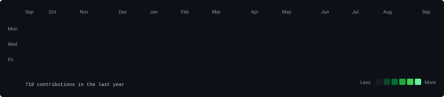
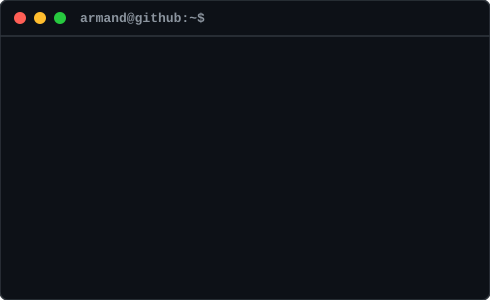

<h3><code>bendev202@github ~ $ ./contributions.sh</code></h3>

  

<h3><code>bendev202@github ~ $ whoami</code></h3>
<table>
  <tr>
    <td valign="top"></td>
    <td valign="top"></td>
  </tr>
</table>

---

## About this repo

This repository powers an animated GitHub profile README using self-generated SVG assets.

- `avi-ascii.svg` — a self-typing monochrome ASCII portrait
- `info-card.svg` — a neofetch-style info panel
- `contrib-heatmap.svg` — a live contribution calendar rendered from GitHub HTML

These assets are generated by Python scripts in `scripts/` and refreshed daily by GitHub Actions.

## Regenerate the profile art

1. Install dependencies:

        python -m pip install -r scripts/requirements.txt

2. Fetch contribution data and build the heatmap:

        python scripts/fetch_contributions.py
        python scripts/render_heatmap_svg.py

3. Rebuild the info card and ASCII portrait when needed:

        python scripts/make_info_card.py
        python scripts/make_ascii_svg.py

4. Commit the generated SVGs and push.

## Automation

The `.github/workflows/update-profile-art.yml` workflow refreshes `data/contributions.json` and `contrib-heatmap.svg` daily.

## Notes

- `scripts/prep_photo.py` is used once to prepare a photo for the ASCII portrait.
- `scripts/requirements.txt` includes `pillow`, `numpy`, `opencv-python`, and `rembg` for portrait generation, while the daily workflow only needs `requests` and `beautifulsoup4`.
